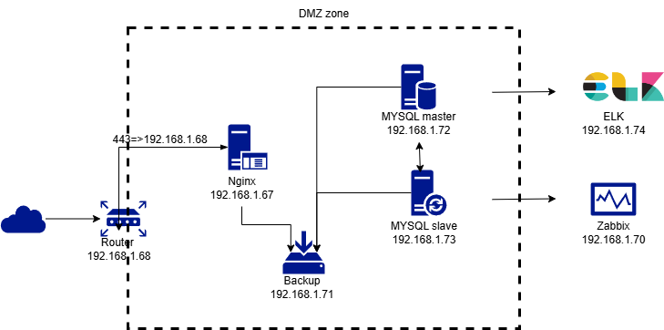
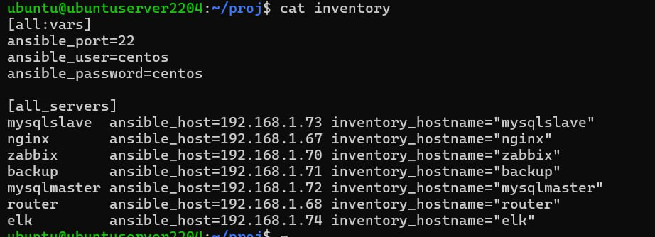
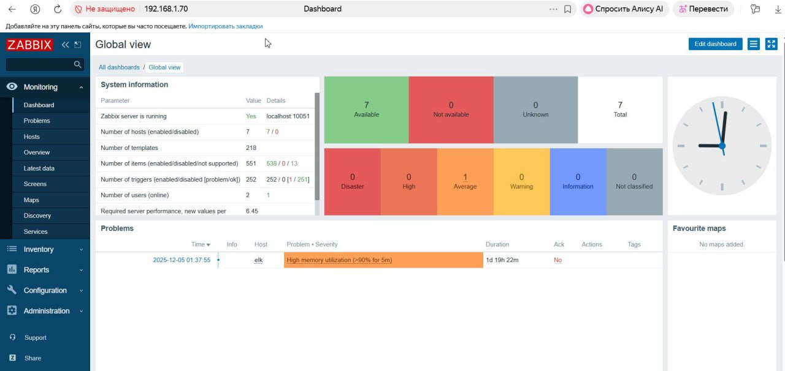
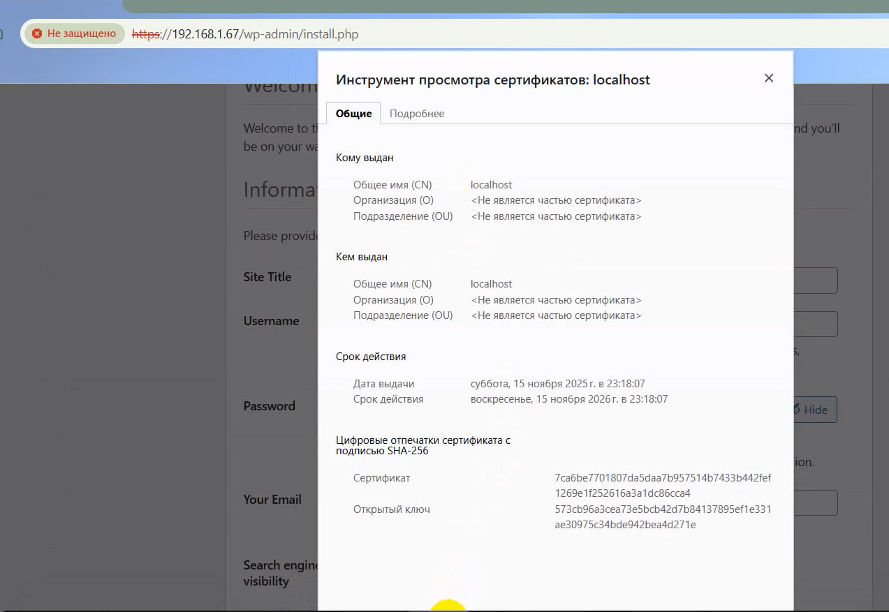

# Проектная работа

Описание/Пошаговая инструкция выполнения домашнего задания:
Создание рабочего проекта

Веб проект с развертыванием нескольких виртуальных машин должен отвечать следующим требованиям:

+ включен https;
+ основная инфраструктура в DMZ зоне;
+ файрвалл на входе;
+ сбор метрик и настроенный алертинг;
+ организован централизованный сбор логов;
+ организован backup.

Установка виртуальных машин, а так же настройка их с помощью Ansible\
Много сервисов недоступны из-за санкций поэтому для проекта пришлось вручную скачивать и потом устанавливать все вплоть до Zabbix\
После усановки и настройки мы получаем стенд с иртуальными машинами в зоне DMZ

Хосты прописаны в файле inventory

## Описание Хостов и их предназначения в стенде
Router - вхоодящий роутер который закрывает доступ в ДМЗ зону с внешней сети разрешая только передачу 443 \
порта на WEB сервер 192.168.1.68

Nging - Хост на котором установлен стек: Nginx + PHP-FPM + Wordpress (БД находится на MySQL Master + \
 Zabbix Agent (для мониторина Zabbix Server) + Filebaet (для передачи логов в ELK c Logstash)

MySQL Master - Хост на котором установлен MySQL в статусе Мастера в котором создана БД worpress. \
С него проиходит репликация на MySQL Slave
ELK - Поднят стек Elasticserch+Logstash+Kibana для сбора и визуализации собранных логов

Zabbix - мониторинг хостов через агентов установленных на хостах

## Доступ к службам
Zabbix http://192.168.1.70/zabbix/ \
Wordpress (Nginx+PHP-FPM) https://192.168.1.67/wp-admin/ \
ELK http://192.168.1.74:5601/app/home#/ \

SSL сертификат для сайта

.
Код выложила на Яндекс Диске потому что для GitHuba большой 2ГБ
https://disk.yandex.ru/d/oVoffKi07uurKQ
